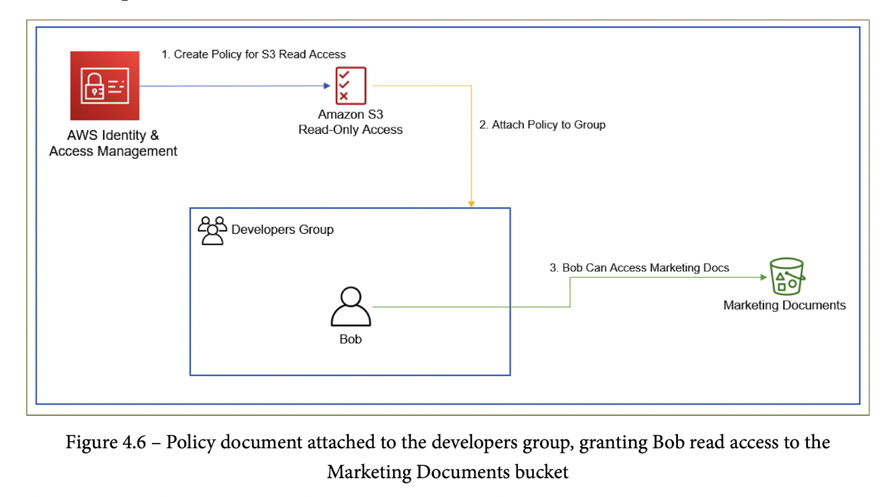
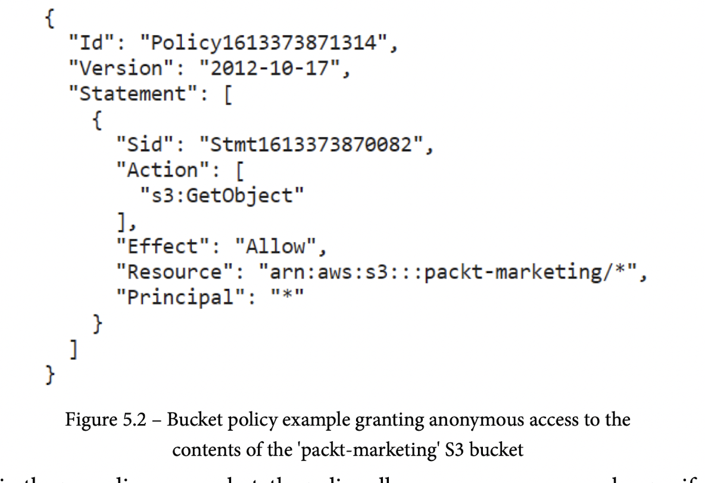
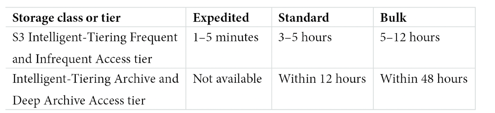
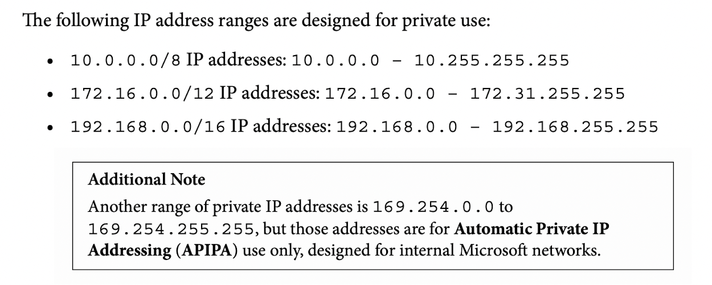
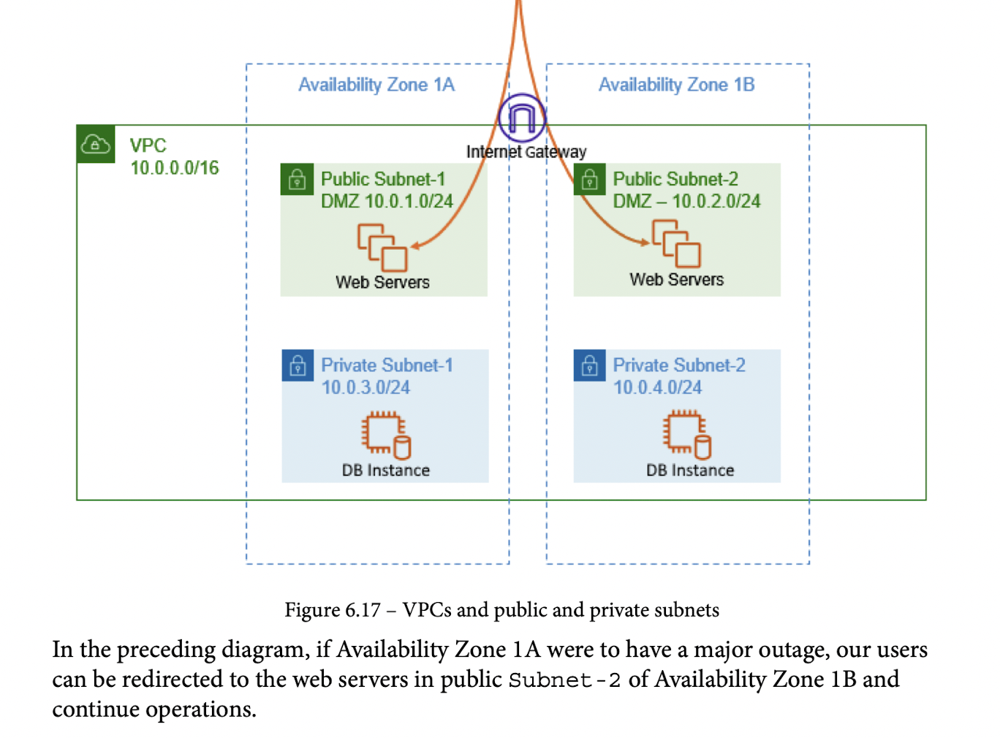
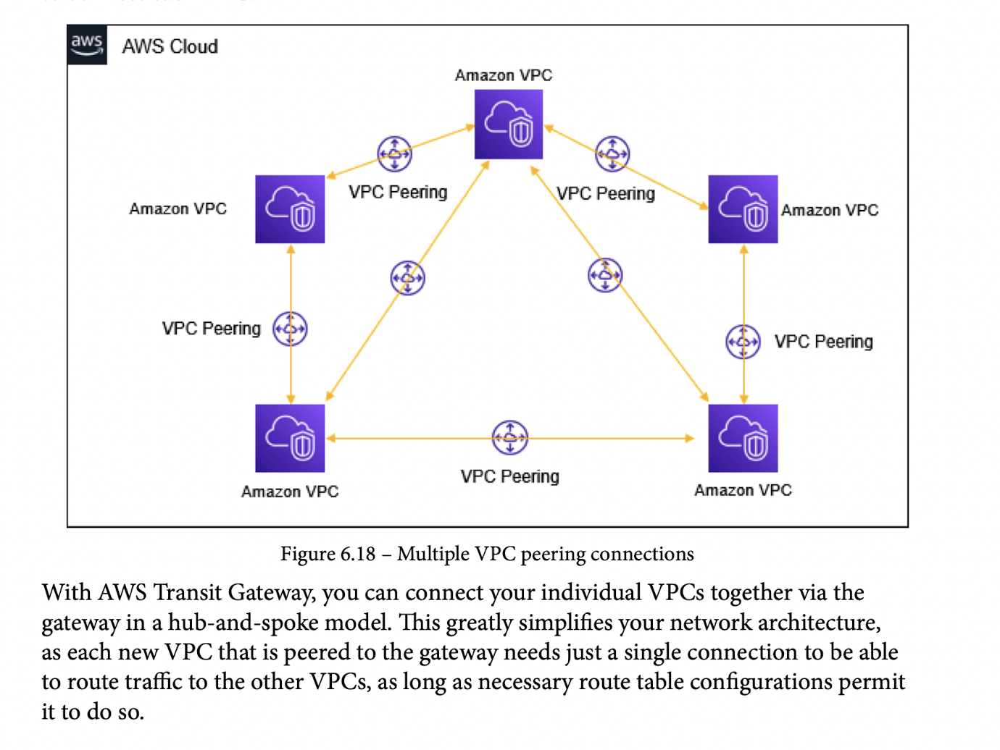
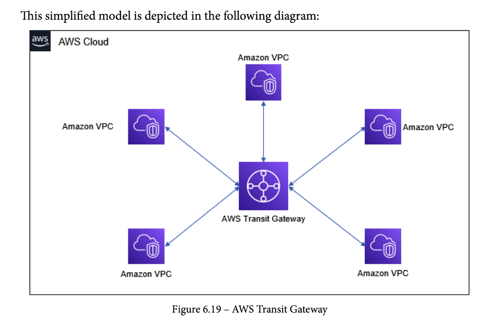
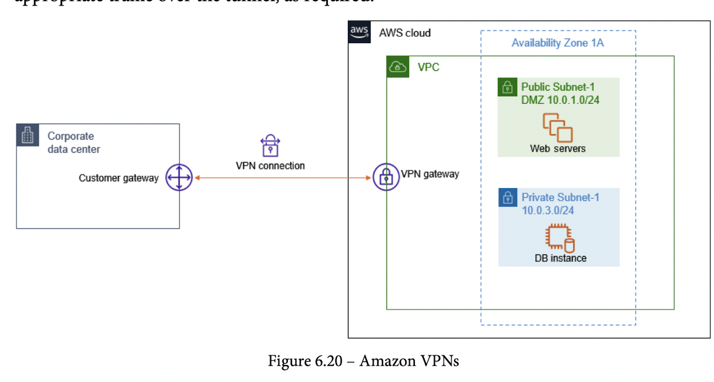

# AWS - Certified Cloud Practioner (CCP) Notes

- [AWS - Certified Cloud Practioner (CCP) Notes](#aws---certified-cloud-practioner-ccp-notes)
  - [Section 1: Cloud Concepts](#section-1-cloud-concepts)
    - [Chapter 01 - What is Cloud Computing?](#chapter-01---what-is-cloud-computing)
      - [What is cloud computing?](#what-is-cloud-computing)
      - [Virtualization Basics](#virtualization-basics)
      - [Cloud computing models](#cloud-computing-models)
      - [Cloud deployment models](#cloud-deployment-models)
    - [Chapter 02 - Introduction to AWS and the Global Infrastructure](#chapter-02---introduction-to-aws-and-the-global-infrastructure)
      - [What is AWS](#what-is-aws)
      - [AWS Global Infrastructure](#aws-global-infrastructure)
        - [Regions](#regions)
        - [AZs](#azs)
        - [Edge locations (aid with `Content Delivery Network (CDN)/caching services`)](#edge-locations-aid-with-content-delivery-network-cdncaching-services)
          - [Regional edge caches](#regional-edge-caches)
        - [Regional Servies](#regional-servies)
        - [On-Premise Services](#on-premise-services)
        - [Global Services](#global-services)
      - [AWS Support Plans](#aws-support-plans)
      - [AWS Service Health Dashboard](#aws-service-health-dashboard)
      - [AWS Acceptable use Policy (AuP)](#aws-acceptable-use-policy-aup)
    - [Chapter 03 - Exploring AWS Accounts, Multi-Account Strategy, and AWS Organizations](#chapter-03---exploring-aws-accounts-multi-account-strategy-and-aws-organizations)
      - [Why have multi-account AWS environment](#why-have-multi-account-aws-environment)
      - [AWS Landing Zone](#aws-landing-zone)
      - [AWS Control Tower](#aws-control-tower)
      - [AWS Organizations](#aws-organizations)
        - [Consolidated billing](#consolidated-billing)
        - [How many AWS accounts do you need?](#how-many-aws-accounts-do-you-need)
          - [Core AWS OUs (Organization Unit)](#core-aws-ous-organization-unit)
          - [Additional OUs](#additional-ous)
        - [AWS Free Tier](#aws-free-tier)
        - [Exercise 3.1 - Setting up your first AWS Free Tier](#exercise-31---setting-up-your-first-aws-free-tier)
        - [Exercise 3.2 - Setting up a billing alarm](#exercise-32---setting-up-a-billing-alarm)
  - [Section 02: AWS Technologies](#section-02-aws-technologies)
    - [Chapter 04 - Identity and Access Management](#chapter-04---identity-and-access-management)
      - [IAM policies](#iam-policies)
        - [Type of Identity-based Policies](#type-of-identity-based-policies)
      - [Amazon Resource Name (ARN)](#amazon-resource-name-arn)
      - [IAM Roles](#iam-roles)
      - [Reviewing credital reports](#reviewing-credital-reports)
      - [AWS CLI](#aws-cli)
    - [Chapter 05 - Amazon Simple Storage Service (S3)](#chapter-05---amazon-simple-storage-service-s3)
      - [Introduction to storage options on AWS](#introduction-to-storage-options-on-aws)
      - [Introduction to Amazon S3](#introduction-to-amazon-s3)
      - [Amazon S3TA](#amazon-s3ta)
      - [Amazon S3 Glacier](#amazon-s3-glacier)
      - [Intelligent-Tiering](#intelligent-tiering)
      - [Amazon Storage Gateway](#amazon-storage-gateway)
      - [Amazon Snow Family](#amazon-snow-family)
    - [Chapter 06 - AWS Networking Services - VPC, Route53, CloudFront](#chapter-06---aws-networking-services---vpc-route53-cloudfront)
      - [On-Premise Networks](#on-premise-networks)
      - [IP Addressing, Port Numbers, Subnet Masks, and CIDRs Fundamentals](#ip-addressing-port-numbers-subnet-masks-and-cidrs-fundamentals)
      - [Amazon Virtual Private Cloud (VPC)](#amazon-virtual-private-cloud-vpc)
      - [Basic DNS and Routing with Amazon Route53](#basic-dns-and-routing-with-amazon-route53)
      - [Amazon CloudFront](#amazon-cloudfront)
      - [API Gateway Intro](#api-gateway-intro)
    - [Chapter 07 - AWS Compute Services](#chapter-07---aws-compute-services)
    - [Chapter 08 - AWS Database Services](#chapter-08---aws-database-services)
    - [Chapter 09 - High Availability and Elasticity on AWS](#chapter-09---high-availability-and-elasticity-on-aws)
    - [Chapter 10 - Application Integration Services](#chapter-10---application-integration-services)
    - [Chapter 11 - Analytics on AWS](#chapter-11---analytics-on-aws)
    - [Chapter 12 - Automation and Deployment on AWS](#chapter-12---automation-and-deployment-on-aws)
    - [Chapter 13 - Management and Governamce on AWS](#chapter-13---management-and-governamce-on-aws)
  - [Section 3: AWS Security](#section-3-aws-security)
    - [Chapter 14 - IMplenting Security in AWS](#chapter-14---implenting-security-in-aws)
  - [Section 4: Billing and Pricing](#section-4-billing-and-pricing)
    - [Chapter 15 - Billing and Pricing](#chapter-15---billing-and-pricing)
    - [Chapter 16 - Mock Tests](#chapter-16---mock-tests)

## Section 1: Cloud Concepts

### Chapter 01 - What is Cloud Computing?

- Old days:
  - Host entire infrastructure on-premise
  - Hire a group of developers and IT guys to setup/maintain infrastructure
  - Design, build and host app

#### What is cloud computing?

- `AWS` (Amazon Web Services)
- `HA` (High Availability)

- **6 Advantages of Cloud Computing** (MEMORIZE)
  1. Trade capital expense for variable expense
     1. CAPEX (capital expense) vs OPEX (operating expense or variable expense)
  2. Benefit from massive economies of scale
     1. AWS is a big bitch, so acquires hardware on the cheap, b.
  3. Stop guessing capacity
     1. Own nothing. Lease everything.
     2. Pay only for what you consume, when you consume it
  4. Increase speed and agility
  5. Stop spending money running and maintaining data centers
  6. Go global in minutes

#### Virtualization Basics

- `Virtualization` *is one of the core techologies that has enabled cloud computing to go mainstream* and has given birth to cloud providers such as AWS, Microsoft Azure, and Google Cloud Platform (GCP)
- `Hypervisors` have made it possible to emulate the physical hardware components of a single physical server as multiple virtual components (`Virtual Machines (VMs)`)
- A `hypervisor` is essentially a piece of software that sits between the actual physical hardware and the VMs
- AWS Management Console, CLI (command-line interface), APIs (application programming interfaces)
- `Software-as-a-Service` (SaaS)

- Benefits of `virtualization`:
  1. Efficient use of hardware resources via VMs
  2. Reduced cost by sharing physical resources
  3. Self-service provisioning and scaling
  4. Improved security
  5. Flexibility in type of servers provisioned

#### Cloud computing models

  1. `Infrastructure as a Service (IaaS)`
     1. `line-of-business` (LOB) applications
     2. Greatest flexibility to configure the underlying network, storage, and compute services that power LOB applicaitons
     3. Amazon Elastic Computer Cloud (EC2)
  2. `Platform as a Service (PaaS)`
     1. Examples: AWS Elastic Beanstalk, AWS OpsWorks, AWS Lambda, Amazon Relational Database Service (RDS)
  3. `Software as a Service (SaaS)`
     1. Dropbox

#### Cloud deployment models

  1. `Public Cloud`
  2. `Private Cloud`
  3. `Hybrid Cloud`

Answer Summary:

- Missed one question because I didn't read the prompt properly. No biggie.

### Chapter 02 - Introduction to AWS and the Global Infrastructure

- Disaster Recover (DR)

#### What is AWS

- Largest cloud-computing provider
- 175 distinct services
- Began in 2002 (20 years ago)
- 2004 Launch of Simple Queue Service (SQS)
- 2006 AWS Official Launch (SQS, EC2, S3)
- 2010 Amazon.com migrates to AWS

#### AWS Global Infrastructure

- Comprises multiple `data centers` that house all the `servers`, `storage devices`, and `networking equipment` across different `regions`
- `AWS Region` is a physical location where AWS will host a cluster of `data centers`
- Each reigion is comprised of `Availability Zones` (AZs) (within 100km of each other)
- 77 AZs within 24 Regions

##### Regions

- A `region` is a minimum of 2 AZs
- `us-east-1` - North Virginia region - 6 AZs - First among equals

Benefits:

1. Closer means faster UX
2. Compliance and regulation laws region specific
3. DR mitigation if a specific region goes down

##### AZs

- AZs linked by high-bandwidth, low-latency private metro-fiber links
- Distribute traffic among AZs via Amazon `Elastic Load Balancer` (ELB)

##### Edge locations (aid with `Content Delivery Network (CDN)/caching services`)

- Provide infrastructure and software that enable data to be processed and analyzed closer to the end user
- Uses smart caching of frequently access data near physical localtion of end users (separate from Region/AZ location)
- `Amazon's CloudFront` - CDN service on the edge
- `Amazon Simple Storage Service (Amazon S3)` - object-storage solution for any type of data
- `Amazon S3 Transfer Acceleration` - accelerate data transfer from S3 to the edge
- Edge locations are connected to AWS regions via `AWS backbone network` (100 Gigabit Ethernet GbE)
- Main limitation is that edge cache size is limited. Infrequently accessed data is removed from cache to make room for new content

###### Regional edge caches

- Bigger cache, store infrquently used content longer so edge locations can pull from regional edge caches instead of AZs

##### Regional Servies

- Relational Database Service (RDS) database (services that require a selection of a region where the physical infrastructure will reside (servers, storage, databases))

##### On-Premise Services

- `Amazon Snow Family`
  - Snowball Edge Devices
  - Snowcone
  - Snowmobile
    - Devices facilitate the transfer of larege amounts of data to AWS S3
- `Amazon Storage Gateway`
  - Enables offloading on-premise storage to Amazon S3
  - Can be used as backup if data latency is sensitive
  - `Amazon Outposts` - 42U rack, scalable from 1 rack to 96 racks (mini AWS on premise)
    - Helps meet strigent local data-residency requirements
    - Can run `ECS`, `EKS (Elastic Kubernetes Service)`, `EMR (Elastic Map Reduce)`

##### Global Services

- Most services are region based
- As an example of global service, take indiviual user accounts (`Identity and Access Management (IAM)`)
- Other examples of global services:
  - `AWS IAM`
  - `Amazon CloudFront`
  - `Amazon Route 53`
  - `Amazon S3`

#### AWS Support Plans

- `Basic`, `Developer`, `Business`, `Enterprise`
- `Basic Support Plan`
  - No technical support!
  - Customer support for any `account-related issues`, such as `bill payment` and `logging issues`
  - Access to documentation, whitepapers, and forums
  - Access suport via `email, chat and phone 24/7` - Amazon calls you
  - Access to `7 basic Trusted Advisor tools` checks
- `Developer Support Plan`
  - Ideal if you *experimenting or testing with AWS*
  - Meant for non-production workloads and gives access to technical support
  - Reasonable price
  - Support focus on problems with technical configuration of AWS use cases (does not offer application-layer support)
  - Email support during business hours (no phone supoort)
  - General cases (`within 24 hour response time`). System-impared issues (`within 12 hours`)
- `Business Support Plan`
  - 24/7 support via email, chat, and telephone.
  - Critical down system (`1 hour response time`)
  - Unlike `Developer` plan, support is offered for interoperability issuews between AWS resources and 3-party software
  - Addtional cost, can get `AWS Infrastructure Event Management (IEM)`
  - IEM helps with product launches and migration task and post-event review
  - `Full-set of AWS trusted Advisor` checks
    - Five Categories of support:
      1. Cost Optimization
      2. Security
      3. Fault Tolerance
      4. Performance
      5. Service Limits
- `Enterprise Support Plan`
  - 15,000/month (starts at)
  - Designated `Technical Account Manager (TAM)`
    - actively monitor your environment
    - helps with planning, design and implementation of cloud projects
    - Access to Well-Architected reviews
    - `Service-Level Agreements (SLAs)`
      - 24/7 email, chat and phone support
      - `15 minute response time` for business-critical technical issues

- Amazon support plan summary:

#### AWS Service Health Dashboard

- `Service Health Dashboard` - Shows the health status of all AWS services (is my system down?)
- `Personal Health Dashboard` - Published availability status of services relevant to your workloads
  - Personalized view of service health
  - Proactive notifications
  - Detail troubleshooting guidance
  - Integration and automation (integrates with CloudWatch events and can launch Lambdas to automate solutions)
  - Aggregate health events across AWS Organizations

#### AWS Acceptable use Policy (AuP)

- `Acceptable use Policy (AuP)`
  - Describes acceptable and prohibitive uses of AWS resources

### Chapter 03 - Exploring AWS Accounts, Multi-Account Strategy, and AWS Organizations

- Manage multiple `AWS Accounts` using `AWS Organizations`

#### Why have multi-account AWS environment

- `User Acceptance Testing (UAT)`
- Each environment should be isolated within a specific `AWS Account`
  - Sandbox (Experimental)
  - Development
  - Testing
  - Production
- Multiple accounts helps limit the blast radius of a catastrophic failure
- Benefits of a multi-account architecure:
  - Administrative isolation between workloads
  - Limited visibility and disoverability of workloads
  - Isolation of security and identity management
  - Make a *separate AWS identity management account* and enable `cross-account access` to follow the `principle of least privilege`
  - Isolation of recovery or audit accounts

#### AWS Landing Zone

- `AWS Landing Zone` deprecated in favor or `AWS Control Tower`

#### AWS Control Tower

- Service that automates the building of landing zones following best practice blue prints
  - Creates an AWS Organizations and multi-account setup
  - Uses `AWS Single Sign-On (SSO)` default directory services
  - Account federation using SSO
  - Centralized logging with AWS CloudTrail and AWS Config

#### AWS Organizations

- `AWS Organizations` is used to manage multi-accounts
  - Free service
- 1 `management account (previously termed master account)`
  - Other accounts are `member accounts` of the organization
- Allows for scoping allowed services per account level
- Related accounts can be grouped into `Organization Units (OUs)`
- `Service Control Policies (SCPs)` can be applied to OUs or directly to accounts

##### Consolidated billing

- AWS Organizations can be deployed with:
  - `all features`
    - Enables Service Control Policies and Tag policies along with consolidated billing
  - `consolidated billing feature`
- The `management account` is responsible for all billing incurred by member accounts
- Consolidate account benefits:
  - single bill
  - easy tracking
  - `volume discounts`
  - free service

##### How many AWS accounts do you need?

###### Core AWS OUs (Organization Unit)

- At a minimum, should create an `infrastructure OU` adnd a `security OU`
- Infrastructure OU
  - contain services that can be shared accross all accounts, i.e. repository of `Amazon Machine Images (AMI)`
- Security OU
  - centralized `Identity and Access Management (IAM)` account to host user accounts, groups, roles
    - make use of `cross-account` policies to grant identities account access

###### Additional OUs

- `Sandbox OUs` - place to experiment where critical failures will not impact proudction and with expensive caps in place
- `Workloads OUs` - Includes environments such as Production, Dev, Testing
- `Suspended OUs` - Kept for auditing or compliance

##### AWS Free Tier

- 12 months on Free Tier for new accounts
- 85 AWS technologies and services
- 5 GB of Amazon S3, Launch `t.2micro` EC2 instance (750 hours a month (730 hours in a month))
- Run `Amazon Relation Database Service (RDS)` (for 750 hours a month)
- Free tools:
  - `AWS CloudFormation`
    - Infrastructure as code (templates that launch and configure AWS services)
  - `Amazon Elastic Beanstalk (EB)`
    - Orchestraction service that provisions necessary infrastructure to power your app (S3 buckets, EC2 instances, load balancers, etc.)
- Always free servies (limited offering)
  - `Amazon CloudWatch` - 10 custom metrics, 10 alarms, 1 million API requests
  - `Amazon Lambda` - serviceless compute service that allows you to run code in response to events
    - 1 million request or 3.2 million seconds of computer/month
  - `AWS Organizations` - centrally manage and control multi-accounts.
- Free trials:
  - `Amazon Workspaces` - virtual desktops running Linus or Windows
  - `Amazon Detective` - Analyze and visualize security data
  - `Amazon Redshift` - Data warehousing solution

##### Exercise 3.1 - Setting up your first AWS Free Tier

- No notes

##### Exercise 3.2 - Setting up a billing alarm

- Don't forget to terminate labs in order to minimize charges
- Setup a $10 billing threshold alarm

## Section 02: AWS Technologies

### Chapter 04 - Identity and Access Management

- `AWS Identity and Access Management (IAM)` is an `authentication` and `authorization` service that enables you to decide who or what can access the AWS services on your account and what these entities are permitted to do in your account

#### IAM policies

- `IAM policies` are objects attached to a given `IAM identity` (user, group, or role). These policies define what the identity can or cannot do within the AWS account and are written as `JSON documents`

- 6 Type of Policies:
  1. `Identity-based policies`
     - Policies attached to IAM identities (users, groups, roles); limited to within account entities
  2. `Resource-based policies`
     - Attached to a specific resource (can allow for external AWS account access or even anonymous access)
  3. `Permission boundaries`
     - limited the permissions that other permissions can grant to IAM entity
  4. `Organization Service Control Policies (SCPs)`
     - sets maximum permissions for account members of an organization
  5. `Access Control Lists (ACLs)`
  - user created policies that can be edited by the customer
  1. `Session policies`
     - permissions when accessing a resource programatically
     - permissions that manage access to certain resources (grant basic read/write permissions)

- `IAM policy simulator` can be used to test out policies or troubleshoot any access issues

##### Type of Identity-based Policies

- `Managed AWS policies`
  - standard policy templates that are managed by AWS and cannot be edited by the customer
- `Customer-managed policies`
  - user created policies that can be edited by the customer
- `Inline policies`
  - policies that are createed and directly attached to an IAM identity

#### Amazon Resource Name (ARN)

- Used to uniquely identity an AWS resource
  - `arn:partition:service:region:account-id:resource-type:resource-id`
  - `resource-type` and `resource-id` designation vary by service

#### IAM Roles

- Not attached to a specific IAM entity
- Mainly assumed by services to temporary grant them access to AWS resources
- Use cases:
  1. An AWS service that needs access to another AWS service (EC2 running Django needs access to RDS service)
  2. External IAM user needs access to internal services
  3. A federated user needs access to resources
     - `Identity Provider (Idp)`
- Elimates the need to create an IAM user for external user access to resources
- IAM roles make use of `Security Token Service (STS)`
  - Assigns the following to the identity that assumes the role:
    - `access key ID`
    - `secret access key`
    - `security token`

#### Reviewing credital reports

- Allows for auditting of IAM identities

#### AWS CLI

- allows for programatic access to AWS services
- `aws configure` - begin configuration process (need access key ID, access secret key, default region, default format)

### Chapter 05 - Amazon Simple Storage Service (S3)

- `Amazon Simple Storage Solution (S3)`is an object storage solution

#### Introduction to storage options on AWS

- 3 Storage Options:
  1. `Block storage`
     - architectural design that enables the storage of data onto media such as HD, in fixed-sized chunks.
     - `Elastic Block Store (EBS)`
       - Use cases:
         - file system storage
         - large databases
         - large applications `enterprise resource planning (ERP)` solutions
     - Main pro: `low-latency`
  2. `File storage`
     - centralized location for data; organized in folder/file hierarchy
     - main use case: file-sharing
     - `Elastic File System (EFS)` - managed elastic filesystem
     - `FSx for Lustre` - high performance fs, scales in GBs. High IOPS (Linux EC2)
     - `FSx for Windows File Server` - support `Server Message Block (SMB)` protocol (Windows EC2)
  3. `Object storage`
     - flat file structure
     - S3 allows you to create `buckets` which are containers that contain your data (`objects`)
     - Use cases: store digital assets (documents, images, and video)
     - Enables rich analytics

#### Introduction to Amazon S3

- S3 uptime eleven 9s.
- bucket names must be unique
- Objects accessible in 2 ways:
  - `Virtual hosted-style endpoints`
    - `https://bucket-name.s3.amazonaws.com/object-name`
  - `Website endpoint` - bucket configured with static website hosting service
- `Amazon S3 Transfer Acceleration (S3TA)` buckets cannot have dots
- By default, only the resource owner can access a bucket
- Two methods to control access to a bucket/objects:
  1. Attach a resource-based policy (`bucket policy`)
  2. Attach `access-control lists (ACLs)`
- `Bucket policy` - applied directly to an entire bucket, grant access to bucket/objects inside

- `ACLs` - considered legacy (`Server access logging` use case that still requies ACLs)
- S3 charges based on 6 components:
  1. storage amount, duration, storage class
  2. request/data retrievals
  3. data transfers
  4. use of acceleration
  5. data management
  6. use of `Amazon S3 Object Lambda` to transfer data
- Storage classes:
  - `Amazon S3 Standard` - default (durability of 11 9's and availability of 4 9's and 3 AZ replication)
  - Infrequent storage classes have a `minimum size of 128 KB`
  - `Amazon S3 Standard-Infrequent Access (S3 Standard-IA)`
    - ideal for data backups and DR purposes (as available as Standard, but accessed less frequently)
  - `Amazon S3 One Zone-Infrequent Access (S3 One Zone-IA)`
    - IA stands for Infrequent Access

- `Amazon Cross-Region Replication (CRR)` - is used to asynchronously copy objects across AWS buckets in different AWS Regions
  - reduce latency, increase operation efficiency, meet reg compliance requirements
- `Same-Region Replication (SRR)`
- `Amazon S3 Lifecycle Management` - rules to move objects to IA or delete after a given duration
  - Transition actions
  - Expiration actions
- S3 Encryption - by default objects are not encrypted
  - `Server-side encryption` - 3 options
    1. `Amazon S3-managed keys (SSE-S3)` - Amazon encrypts with a 256-bit `Advanced Encryption Standard (AES-256)`
    2. `SSE with Customer Master Keys (CMKs)` stored in `AWS Key Management Service` (`SSE-KMS`)
    3. `SSE with Customer Provided Keys (CPKs)` - (`SSE-C`) - ideal if you must manage your owns keys do to regulations

#### Amazon S3TA

- `Amazon S3 Transfer Acceleration (S3TA)` - allows for faster transfer of data to and from S3 (via CloudFront)

#### Amazon S3 Glacier

- use for archival storage (where real-time availability is not critical)
- data not immediately accessible; must require a retrieval job first
- data is archieve as `.zip` or `.tar` (1 byte to 40 terabytes as opposed to 5 TB limit on S3
- can group up data in `vaults`; region specific
- `Write Once Read Many (WORM)` special vault lock policies or time-based record retention to comply with regulations
- `Retrieval Options`:
  - Amazon S3 Glacier (Standard (3-5 hours), Expedited (1-5 minutes for 250MB), Bulk (5-12 hours))
  - Amazon S3 Glacier Deep Archiv (Standard (12 hours), Bulk (petabytes in 48 hours))

#### Intelligent-Tiering

- Use machine learning to automate the data storage class assignment of objects (incurs monitoring fee)
- Not used in 30 days (S3 Standard-IA), Not used in 90 days (Amazon Glacier), Not used in 180 days (Amazon Glacier Deep Archive)

#### Amazon Storage Gateway

- `Amazon Storage Gateway` - allows a customer to connect their on-premise resources to Amazon S3
  w with S3 object versioning enabled! Boom!
- Protocols: `Network File System (NFS)`, `Simple Message Block (SMB)`, `Internet Small Computer System Interface (iSCSI)`
- Use `virtual private network (VPN)` or `AWS Direct Connect`
- Deployment options:

- `File Gateway` - enables connection via NFS/SMB protocols
  - `Amazon S3 File Gateway` vs `Amazon FSx File Gateway (allows for Active Directory (AD) integration)`
- `Volume Gateway` - block storage volumes via iSCSI. Modes `Cache mode, Store mode, Tape Gateway`

#### Amazon Snow Family

- `Trusted Platform Module (TPM)` - used to detect unauthorized modifivations to hardware, software or firmware
- Basically big ass usb drives to physically transfer data to S3
- `Snowball Edge Compute Optimized (ML, 52 vCPU, GPU, 42 TB and 7.68 SSD)` vs `Snowball Edge Storage Optimized (80TB HD and 1TB SATA (serial advanced technology attachement)`

### Chapter 06 - AWS Networking Services - VPC, Route53, CloudFront

- `Virtual Private Cloud (VPC)` - enables customers to build multiple isolated and secure networks within AWS
- `AWS Route53` - DNS service that allows you to map domain names to IP addresses
- `Amazon CloudFront` - web content delivery network

#### On-Premise Networks

- Corporate networks are generally divided into two separate networks:
  - Internal Network
    - `End User Computing (EUC) Virtual LAN (vLAN)`
    - `Demilitarized Zone (DMZ)` - are where services are deployed that can be exposed to the internet

#### IP Addressing, Port Numbers, Subnet Masks, and CIDRs Fundamentals

- `Internet Protocol address (IP address)` Two versions IPv4 and IPv6
  - 32^2 (IPv4) / 128^2 (IPv6) ... 4.29 billion limitation
- `Internet Assigned Numbers Authority (IANA)` - responsible for assigning IP addresses to networks

- `Network Address Translation (NAT)` - translates IP addresses from one network to another
- `Internet Engineering Task Force (IETF)` - `IPv4` and `IPv6` (1990s) standards
~
- First IP address is known as the `network ID - 192.168.1.0`
- Last IP address is known as the `broadcast address - 192.168.1.255`
- Supports 254 hosts
- `Subnet marks` - allow you to split an IP address block into a network portion and a host portion
- `Class A network` - subnet mask `255.0.0.0`
- `Class C network` - subnet mask `255.255.255.0`
- `Classless Interdomain Routing (CIDR)` - is essentially another way to represent subnet masks but offers more flexibility

#### Amazon Virtual Private Cloud (VPC)

- `Amazon Virtual Private Cloud (Amazon VPC)` - is a virtual network in the cloud
- `Subnets` are restricted to a single Avalability Zone (AZ)
  - This allows for High Availability via subnet replication of resources on additional AZs
- Need to deploy and `Internet Gateway` in order to grant a `VPC` internet access

- VPC Security:
  - `Security Group`:
    - is a firewall that let's you configure what type of traffic is permitted (inbound/outbound) to EC2 instance
    - EC2 launch requires at least one attached Security Group; up to max of 5 SCs
  - `Network Access Control Lists (NACLs)`
- The default SC allows all inbound traffic from instances within the same SC and allows all outbound traffic. In bound traffic outside of the security group is blocked by default
- SGs are `stateful`
- Responses to outbound requests are allowed by default. Outbound responses to allowed in-bound requests are also allowed by default.
- Security Groups:
  - You can configure `allow` rules but not `deny` rules
  - You can separate rules for inbound and outbound traffic
  - You can filter traffic based on `protocols` and `port` numbers
  - SGs operate at the `instance-level`
- `Network Access Control Lists (NACLs)` - operate at the `subnet-level`
  - `NACLs` are `stateless` - require explict config of both inbound and outbound traffic
- `Network Address Translation (NAT)` - acts are a proxy in order to route network traffic to private VPCs (such as DB instances)
- `VPC peering` - is a private network connection between two VPCs
- `VPC transit gateway` - simplifies setting up multi-interconnected VPC peering

- `Virtual Private Network (VPC)` - secure encrypted site-to-site tunnel established between endpoints over the internet
  - `AES 128 or 256-bit` - `Internet Protocol security (IPsec)` encryption
  - Need to create a `Virtual Private Gateway (VPG)` to connect VPC to on-premise network

- `Direct Connect` - enables you to connect on-premise network to VPC via a dedicated private connection that pypasses the internet

#### Basic DNS and Routing with Amazon Route53

#### Amazon CloudFront

#### API Gateway Intro

### Chapter 07 - AWS Compute Services

### Chapter 08 - AWS Database Services

### Chapter 09 - High Availability and Elasticity on AWS

### Chapter 10 - Application Integration Services

### Chapter 11 - Analytics on AWS

### Chapter 12 - Automation and Deployment on AWS

### Chapter 13 - Management and Governamce on AWS

## Section 3: AWS Security

### Chapter 14 - IMplenting Security in AWS

## Section 4: Billing and Pricing

### Chapter 15 - Billing and Pricing

### Chapter 16 - Mock Tests
