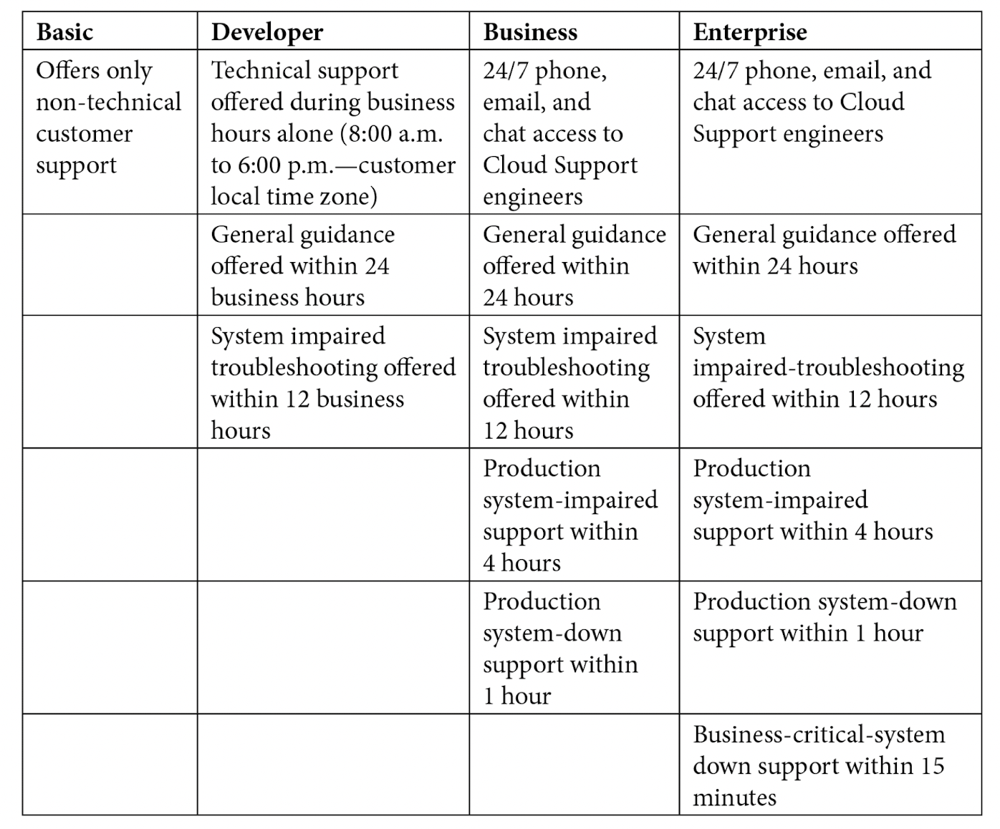
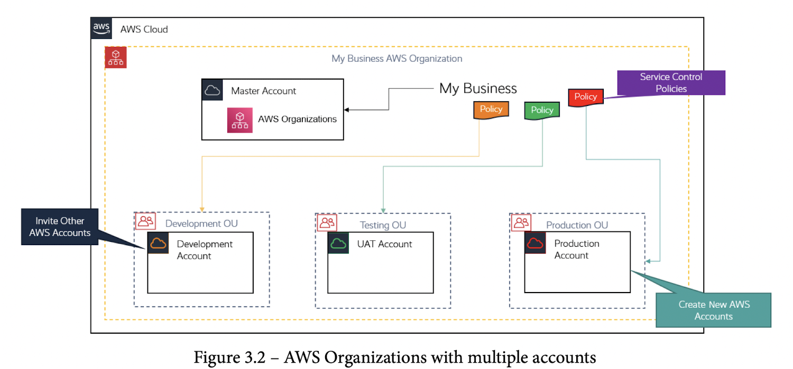
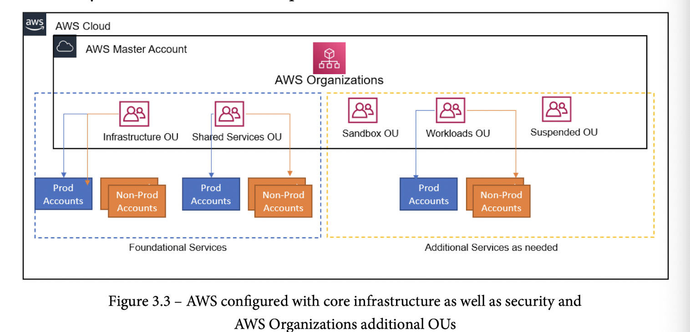

# AWS - Certified Cloud Practioner (CCP) Notes

- [AWS - Certified Cloud Practioner (CCP) Notes](#aws---certified-cloud-practioner-ccp-notes)
  - [Section 1: Cloud Concepts](#section-1-cloud-concepts)
    - [Chapter 01 - What is Cloud Computing?](#chapter-01---what-is-cloud-computing)
      - [What is cloud computing?](#what-is-cloud-computing)
      - [Virtualization Basics](#virtualization-basics)
      - [Cloud computing models](#cloud-computing-models)
      - [Cloud deployment models](#cloud-deployment-models)
    - [Chapter 02 - Introduction to AWS and the Global Infrastructure](#chapter-02---introduction-to-aws-and-the-global-infrastructure)
      - [What is AWS](#what-is-aws)
      - [AWS Global Infrastructure](#aws-global-infrastructure)
        - [Regions](#regions)
        - [AZs](#azs)
        - [Edge locations (aid with `Content Delivery Network (CDN)/caching services`)](#edge-locations-aid-with-content-delivery-network-cdncaching-services)
          - [Regional edge caches](#regional-edge-caches)
        - [Regional Servies](#regional-servies)
        - [On-Premise Services](#on-premise-services)
        - [Global Services](#global-services)
      - [AWS Support Plans](#aws-support-plans)
      - [AWS Service Health Dashboard](#aws-service-health-dashboard)
      - [AWS Acceptable use Policy (AuP)](#aws-acceptable-use-policy-aup)
    - [Chapter 03 - Exploring AWS Accounts, Multi-Account Strategy, and AWS Organizations](#chapter-03---exploring-aws-accounts-multi-account-strategy-and-aws-organizations)
      - [Why have multi-account AWS environment](#why-have-multi-account-aws-environment)
      - [AWS Landing Zone](#aws-landing-zone)
      - [AWS Control Tower](#aws-control-tower)
      - [AWS Organizations](#aws-organizations)
        - [Consolidated billing](#consolidated-billing)
        - [How many AWS accounts do you need?](#how-many-aws-accounts-do-you-need)
          - [Core AWS OUs (Organization Unit)](#core-aws-ous-organization-unit)
          - [Additional OUs](#additional-ous)
        - [AWS Free Tier](#aws-free-tier)
        - [Exercise 3.1 - Setting up your first AWS Free Tier](#exercise-31---setting-up-your-first-aws-free-tier)
        - [Exercise 3.2 - Setting up a billing alarm](#exercise-32---setting-up-a-billing-alarm)
  - [Section 02: AWS Technologies](#section-02-aws-technologies)
    - [Chapter 04 - Identity and Access Management](#chapter-04---identity-and-access-management)
    - [Chapter 05 - Amazon Simple Storage Service (S3)](#chapter-05---amazon-simple-storage-service-s3)
    - [Chapter 06 - AWS Networking Services - VPC, Route53, CloudFront](#chapter-06---aws-networking-services---vpc-route53-cloudfront)
    - [Chapter 07 - AWS Compute Services](#chapter-07---aws-compute-services)
    - [Chapter 08 - AWS Database Services](#chapter-08---aws-database-services)
    - [Chapter 09 - High Availability and Elasticity on AWS](#chapter-09---high-availability-and-elasticity-on-aws)
    - [Chapter 10 - Application Integration Services](#chapter-10---application-integration-services)
    - [Chapter 11 - Analytics on AWS](#chapter-11---analytics-on-aws)
    - [Chapter 12 - Automation and Deployment on AWS](#chapter-12---automation-and-deployment-on-aws)
    - [Chapter 13 - Management and Governamce on AWS](#chapter-13---management-and-governamce-on-aws)
  - [Section 3: AWS Security](#section-3-aws-security)
    - [Chapter 14 - IMplenting Security in AWS](#chapter-14---implenting-security-in-aws)
  - [Section 4: Billing and Pricing](#section-4-billing-and-pricing)
    - [Chapter 15 - Billing and Pricing](#chapter-15---billing-and-pricing)
    - [Chapter 16 - Mock Tests](#chapter-16---mock-tests)

## Section 1: Cloud Concepts

### Chapter 01 - What is Cloud Computing?

- Old days:
  - Host the entire infrastructure
  - Hire a group of developers
  - Design, build and host app

#### What is cloud computing?

- AWS (Amazon Web Services)
- HA (High Availability)

- **6 Advantages of Cloud Computing** (MEMORIZE)
  1. Trade capital expense for variable expense
     1. CAPEX (capital expense) vs OPEX (operating expense or variable expense)
  2. Benefit from massive economies of scale
     1. AWS is a big bitch, so acquires hardware on the cheap, b.
  3. Stop guessing capacity
     1. Own nothing. Lease everything.
     2. Pay only for what you consumer, when you consume it
  4. Increase speed and agility
  5. Stop spending money running and maintaining data centers
  6. Go global in minutes

#### Virtualization Basics

- `Virtualization` *is one of the core techologies that has enabled cloud computing to go mainstream and has given birth to cloud providers such as AWS, Microsoft Azure, and Google Cloud Platform (GCP)
- `Hypervisors` have made it possible to emulate the physical hardware components of a single physical server as multiple virtual components (`Virtual Machines (VMs)`)
- A `hypervisor` is essentially a piece of software that sits between the actual physical hardware and the VMs
- AWS Management Console, CLI (command-line interface), APIs (application programming interfaces)
- `Software-as-a-Service` (SaaS)

- Benefits of `virtualization`:
  1. Efficient use of hardware resources via VMs
  2. Reduced cost by sharing physical resources
  3. Self-service provisioning and scaling
  4. Improved security
  5. Flexibility in type of servers provisioned

#### Cloud computing models

  1. `Infrastructure as a Service (IaaS)`
     1. `line-of-business` (LOB) applications
     2. Greatest flexibility to configure the underlying network, storage, and compute services that power LOB applicaitons
     3. Amazon Elastic Computer Cloud (EC2)
  2. `Platform as a Service (PaaS)`
     1. Examples: AWS Elastic Beanstalk, AWS OpsWorks, AWS Lambda, Amazon Relational Database Service (RDS)
  3. `Software as a Service (SaaS)`

#### Cloud deployment models

  1. `Public Cloud`
  2. `Private Cloud`
  3. `Hybrid Cloud`

Answer Summary:

- Missed one question because I didn't read the prompt properly. No biggie.

### Chapter 02 - Introduction to AWS and the Global Infrastructure

- Disaster Recover (DR)

#### What is AWS

- Largest cloud-computing provider
- 175 distinct services
- Began in 2002 (20 years ago)
- 2004 Launch of Simple Queue Service (SQS)
- 2006 AWS Official Launch (SQS, EC2, S3)
- 2010 Amazon.com migrates to AWS

#### AWS Global Infrastructure

- Comprises multiple `data centers` that house all the `servers`, `storage devices`, and `networking equpment` across different `regions`
- `AWS Region` is a physical location where AWS will host a cluster of `data centers`
- Each reigion is comprised of `Availability Zones` (AZs) (within 100km of each other)
- 77 AZs within 24 Regions

##### Regions

- A `region` is a minimum of 2 AZs
- `us-east-1` - North Virginia region - 6 AZs - First among equals

Benefits:

1. Closer means faster UX
2. Compliance and regulation laws region specific
3. DR mitigation if a specific region goes down

##### AZs

- AZs linked by high-bandwidth, low-latency private metro-fiber links
- Distribute traffic among AZs via Amazon `Elastic Load Balancer` (ELB)

##### Edge locations (aid with `Content Delivery Network (CDN)/caching services`)

- Provide infrastructure and software that enable data to be processed and analyzed closer to the end user
- Uses smart caching of frequently access data near physical localtion of end users (separate from Region/AZ location)
- `Amazon's CloudFront` - CDN service on the edge
- `Amazon Simple Storage Service (Amazon S3)` - object-storage solution for any type of data
- `Amazon S3 Transfer Acceleration` - accelerate data transfer from S3 to the edge
- Ede locations are connected to AWS regions via `AWS backbone network` (100 Gigabit Ethernet GbE)
- Main limitation is that edge cache size is limited. Infrequently accessed data is removed from cache to make room for new content

###### Regional edge caches

- Bigger cache, store infrquently used content longer so edge locations can pull from regional edge caches instead of AZs

##### Regional Servies

- Relational Database Service (RDS) database (services that require a selection of a region where the physical infrastructure will reside (servers, storage, databases))

##### On-Premise Services

- `Amazon Snow Family`
  - Snowball Edge Devices
  - Snowcone
  - Snowmobile
    - Devices facilitate the transfer of larege amounts of data to AWS S3
- `Amazon Storage Gateway`
  - Enables offloading on-premise storage to Amazon S3
  - Can be used as backup if data latency is sensitive
  - `Amazon Outposts` - 42U rack, scalable from 1 rack to 96 racks (mini AWS on premise)
    - Helps meet strigent local data-residency requirements
    - Can run `ECS`, `EKS (Elastic Kubernetes Service)`, `EMR (Elastic Map Reduce)`

##### Global Services

- Most services are region based
- As an example of global service, take indiviual user accounts (`Identity and Access Management (IAM)`)
- Other examples of global services:
  - `AWS IAM`
  - `Amazon CloudFront`
  - `Amazon Route 53`
  - `Amazon S3`

#### AWS Support Plans

- `Basic`, `Developer`, `Business`, `Enterprise`
- `Basic Support Plan`
  - No technical support!
  - Customer support for any `account-related issues`, such as `bill payment` and `logging issues`
  - Access to documentation, whitepapers, and forums
  - Access suport via `email, chat and phone 24/7` - Amazon calls you
  - Access to `7 basic Trusted Advisor tools` checks
- `Developer Support Plan`
  - Ideal if you *experimenting or thesting with AWS*
  - Meant for non-production workloads and gives access to technical support
  - Reasonable price
  - Support focus on problems with technical configuration of AWS use cases (does not offer applicaiton-layer support)
  - Email support during business hours (no phone supoort)
  - General cases (`within 24 hour response time`). System-impared issues (`within 12 hours`)
- `Business Support Plan`
  - 24/7 support via email, chat, and telephone.
  - Critical down system (`1 hour response time`)
  - Unlike `Developer` plan, support is offered for interoperability issuews between AWS resources and 3-party software
  - Addtional cost, can get `AWS Infrastructure Event Management (IEM)`
  - IEM helps with product launches and migration task and post-event review
  - `Full-set of AWS trusted Advisor` checks
    - Five Categories of support:
      1. Cost Optimization
      2. Security
      3. Fault Tolerance
      4. Performance
      5. Service Limits
- `Enterprise Support Plan`
  - 15,000/month (starts at)
  - Designated `Technical Account Manager (TAM)`
    - actively monitor your environment
    - helps with planning, design and implementation of cloud projects
    - Access to Well-Architected reviews
    - `Service-Level Agreements (SLAs)`
      - 24/7 email, chat and phone support
      - `15 minute response time` for business-critical technical issues

- Amazon support plan summary:

#### AWS Service Health Dashboard

- `Service Health Dashboard` - Shows the health status of all AWS services (is my system down?)
- `Personal Health Dashboard` - Published availability status of services relevant to your workloads
  - Personalized view of service health
  - Proactive notificaitons
  - Detail torubleshooting guidance
  - Integration and automation (integrates with CloudWatch events and can launch Lambdas to automate solutions)
  - Aggregate health events across AWS Organizations

#### AWS Acceptable use Policy (AuP)

- `Acceptable use Policy (AuP)`
  - Describes acceptable and prohibitive uses of AWS resources

### Chapter 03 - Exploring AWS Accounts, Multi-Account Strategy, and AWS Organizations

- Manage multiple `AWS Accounts` using `AWS Organizations`

#### Why have multi-account AWS environment

- `User Acceptance Testing (UAT)`
- Each environment should be isolated within a specific `AWS Account`
  - Sandbox (Experimental)
  - Development
  - Testing
  - Production
- Multiple accounts helps limit the blast radius of a catastrophic failure
- Benefits of a multi-account architecure:
  - Administrative isolation between workloads
  - Limited visibility and disoverability of workloads
  - Isolation of security and identity management
  - Make a *separate AWS identity management account* and enable `cross-account access` to follow the `principle of least privilege`
  - Isolation of recovery or audit accounts

#### AWS Landing Zone

- `AWS Landing Zone` deprecated in favor or `AWS Control Tower`

#### AWS Control Tower

- Service that automates the building of landing zones following best practice blue prints
  - Creates an AWS Organizations and multi-account setup
  - Uses `AWS Single Sign-On (SSO)` default directory services
  - Account federation using SSO
  - Centralized logging with AWS CloudTrail and AWS Config

#### AWS Organizations

- `AWS Organizations` is used to manage multi-accounts
  - Free service
- 1 `management account (previously termed master account)`
  - Other accounts are `member accounts` of the organization
- Allows for scoping allowed services per account level
- Related accounts can be grouped into `Organization Units (OUs)`
- `Service Control Policies (SCPs)` can be applied to OUs or directly to accounts

##### Consolidated billing

- AWS Organizations can be deployed with:
  - `all features`
    - Enables Service Control Policies and Tag policies along with consolidated billing
  - `consolidated billing feature`
- The `management account` is responsible for all billing incurred by member accounts
- Consolidate account benefits:
  - single bill
  - easy tracking
  - `volume discounts`
  - free service

##### How many AWS accounts do you need?

###### Core AWS OUs (Organization Unit)

- At a minimum, should create an `infrastructure OU` adnd a `security OU`
- Infrastructure OU
  - contain services that can be shared accross all accounts, i.e. repository of `Amazon Machine Images (AMI)`
- Security OU
  - centralized `Identity and Access Management (IAM)` account to host user accounts, groups, roles
    - make use of `cross-account` policies to grant identities account access

###### Additional OUs

- `Sandbox OUs` - place to experiment where critical failures will not impact proudction and with expensive caps in place
- `Workloads OUs` - Includes environments such as Production, Dev, Testing
- `Suspended OUs` - Kept for auditing or compliance

##### AWS Free Tier

- 12 months on Free Tier for new accounts
- 85 AWS technologies and services
- 5 GB of Amazon S3, Launch `t.2micro` EC2 instance (750 hours a month (730 hours in a month))
- Run `Amazon Relation Database Service (RDS)` (for 750 hours a month)
- Free tools:
  - `AWS CloudFormation`
    - Infrastructure as code (templates that launch and configure AWS services)
  - `Amazon Elastic Beanstalk (EB)`
    - Orchestraction service that provisions necessary infrastructure to power your app (S3 buckets, EC2 instances, load balancers, etc.)
- Always free servies (limited offering)
  - `Amazon CloudWatch` - 10 custom metrics, 10 alarms, 1 million API requests
  - `Amazon Lambda` - serviceless compute service that allows you to run code in response to events
    - 1 million request or 3.2 million seconds of computer/month
  - `AWS Organizations` - centrally manage and control multi-accounts.
- Free trials:
  - `Amazon Workspaces` - virtual desktops running Linus or Windows
  - `Amazon Detective` - Analyze and visualize security data
  - `Amazon Redshift` - Data warehousing solution

##### Exercise 3.1 - Setting up your first AWS Free Tier

- No notes

##### Exercise 3.2 - Setting up a billing alarm

- Don't forget to terminate labs in order to minimize charges
- Setup a $10 billing threshold alarm

## Section 02: AWS Technologies

### Chapter 04 - Identity and Access Management

### Chapter 05 - Amazon Simple Storage Service (S3)

### Chapter 06 - AWS Networking Services - VPC, Route53, CloudFront

### Chapter 07 - AWS Compute Services

### Chapter 08 - AWS Database Services

### Chapter 09 - High Availability and Elasticity on AWS

### Chapter 10 - Application Integration Services

### Chapter 11 - Analytics on AWS

### Chapter 12 - Automation and Deployment on AWS

### Chapter 13 - Management and Governamce on AWS

## Section 3: AWS Security

### Chapter 14 - IMplenting Security in AWS

## Section 4: Billing and Pricing

### Chapter 15 - Billing and Pricing

### Chapter 16 - Mock Tests
